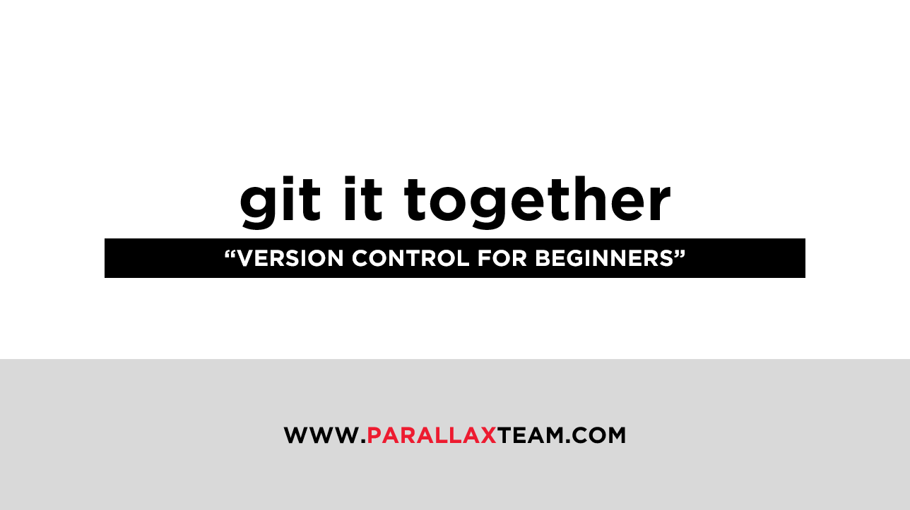

# Where am I?
This repo contains the files for the presentation, _*"Git it Together"*_ that will be demonstrated at [Autodesk University 2018](https://autodeskuniversity.smarteventscloud.com/connect/sessionDetail.ww?SESSION_ID=226472&tclass=popup#.W9dyOlNZ3_Q.twitter). Since this presentation is about getting started on Github, it seemed fitting to build it using the same methodologies.

# Who?
Presenter - John Pierson of [ParallaxTeam](http://www.parallaxteam.com/) and [sixtysecondrevit.com](http://sixtysecondrevit.com/).

# License
 This work is licensed under a <a rel="license" href="http://creativecommons.org/licenses/by-nc-nd/4.0/">Creative Commons Attribution-NonCommercial-NoDerivatives 4.0 International License</a>.

# Directory
_to fill out with directory info when complete_
